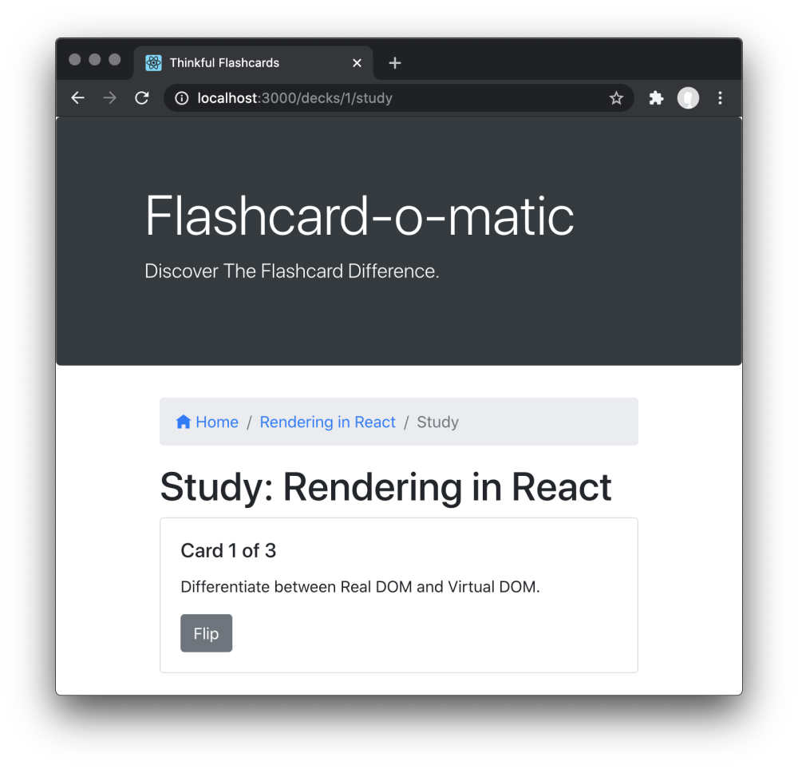

# Project: Flashcard-o-matic

## Project Description 

A local school has decided to put together a flashcard application, Flashcard-o-matic, to help their students study online. Teachers will use this application to create decks of flashcards for the subjects they teach, and students will study the decks. The school needs you to build the application that the students and teachers will use.

## Project setup
Follow the instructions below to get this project up and running on your own machine:

Run `npm install`

To run the tests, you can run the following command: 

`npm test`

Most of the tests in this project wait for content to load via the API before continuing the test. Before the implementation is complete, the content never loads so the test fails with a timeout. As a result, the tests will initially run slowly. It may take perhaps a minute or more for all the tests run. The tests will speed up as the implementation nears completion.

You can run the application using the following command:

`npm start`

The `start` command will start two servers concurrently:

- An API server, powered by json-server, running on `http://localhost:5000`
- A React application running on `http://localhost:3000`

To stop the servers from running, you can press `Ctrl + C`

### Running on Windows

If you are having problems running `npm start` on Windows you may need to run the React client and server in separate terminals. Open a terminal and run `npm run start:react` to start the react application. Open another terminal and run `npm run start:server` to run the server.

## Detailed instructions for use

### Initial Screen

Initial screen shows a list of decks with options to create, study, view, or delete a deck

- Clicking the “Study” button brings the user to the Study screen.
- Clicking the “Edit” button brings the user to the Edit Deck screen.
- Clicking the “Delete” button shows a warning message before deleting the deck

### Delete Deck prompt

When the user clicks the "Delete" button, a warning message is shown and the user can click "OK" or "Cancel". If the user clicks "OK", the deck is deleted and the deleted deck is no longer visible on the Home screen.

### Study

The Study screen is displayed at `/decks/:deckId/study`

### Stopping a session

Stopping a session returns the application to the initial screen and the user is able to change the focus and break duration.

Clicking the "play" button will always start a new focus session.

## Technology

### Built with:

- This application uses Bootstrap 4 for styling and Open-Iconic icons for icons.
- React; Created with create-react-app

## Contributing
Pull requests are welcome. For major changes, please open an issue first to discuss what you would like to change.

Please make sure to update tests as appropriate.

## Authors and acknowledgment
Show your appreciation to those who have contributed to the project.
