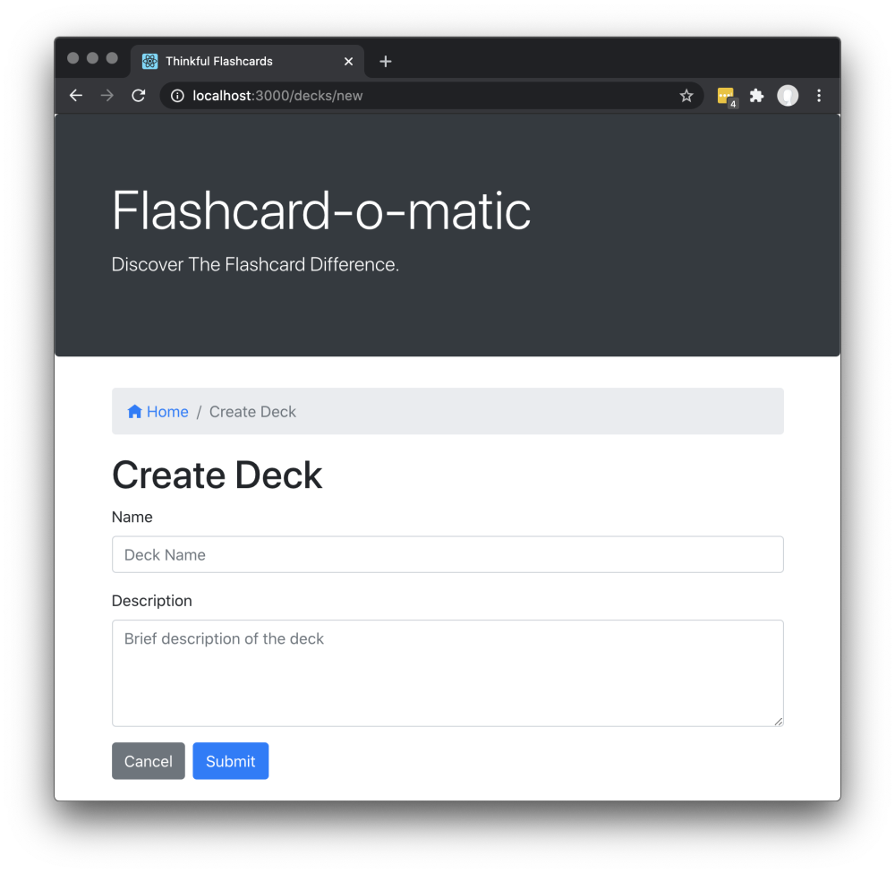

# Project: Flashcard-o-matic

## Project Description 

A local school has decided to put together a flashcard application, Flashcard-o-matic, to help their students study online. Teachers will use this application to create decks of flashcards for the subjects they teach, and students will study the decks. The school needs you to build the application that the students and teachers will use.

## Project setup
Follow the instructions below to get this project up and running on your own machine:

Run `npm install`

To run the tests, you can run the following command: 

`npm test`

Most of the tests in this project wait for content to load via the API before continuing the test. Before the implementation is complete, the content never loads so the test fails with a timeout. As a result, the tests will initially run slowly. It may take perhaps a minute or more for all the tests run. The tests will speed up as the implementation nears completion.

You can run the application using the following command:

`npm start`

The `start` command will start two servers concurrently:

- An API server, powered by json-server, running on `http://localhost:5000`
- A React application running on `http://localhost:3000`

To stop the servers from running, you can press `Ctrl + C`

### Running on Windows

If you are having problems running `npm start` on Windows you may need to run the React client and server in separate terminals. Open a terminal and run `npm run start:react` to start the react application. Open another terminal and run `npm run start:server` to run the server.

## Detailed instructions for use

### Initial Screen

Initial screen shows a list of decks with options to create, study, view, or delete a deck

- Clicking the “Study” button brings the user to the Study screen.
- Clicking the “Edit” button brings the user to the Edit Deck screen.
- Clicking the “Delete” button shows a warning message before deleting the deck

### Delete Deck prompt

When the user clicks the "Delete" button, a warning message is shown and the user can click "OK" or "Cancel". If the user clicks "OK", the deck is deleted and the deleted deck is no longer visible on the Home screen.

### Study

The Study screen is displayed at `/decks/:deckId/study`

- There is a breadcrumb navigation bar with links to home /, followed by the name of the deck being studied and finally the text Study (e.g., Home/Rendering In React/Study).
- The deck title (i.e., "Study: Rendering in React" ) is shown on the screen.
- Cards are shown one at a time, front-side first.
- A button at the bottom of each card "flips" it to the other side.
- After flipping the card, the screen shows a next button (see the "Next button" section below) to continue to the next card.
- After the final card in the deck has been shown, a message (see the "Restart prompt" section below) is shown offering the user the opportunity to restart the deck.
  - If the user does not restart the deck, they should return to the home screen.
- Studying a deck with two or fewer cards should display a "Not enough cards" message (see the "Not enough cards" section below) and a button to add cards to the deck.

### Next button

The next button appears after the card is flipped.

### Restart prompt

When all cards are finished, a message is shown and the user is offered the opportunity to restart the deck. If the user does not restart the deck, they return to the home screen.

### Not enough cards

Studying a Deck with two or fewer cards should display a "Not enough cards" message and a button to add cards to the deck.

Clicking the "Add Cards" button should take the user to the Add Card screen.

### Create Deck

The Home screen has a "Create Deck" button that brings the user to the Create Deck screen.

- A form is shown with the appropriate fields for creating a new deck.
  - The name field is an <input> field of type text.
  - The description field is a <textarea> field that can be multiple lines of text.
- If the user clicks "submit", the user is taken to the Deck screen.
- If the user clicks "cancel", the user is taken to the Home screen.
  
### Deck
  
The Deck screen displays all of the information about a deck.
  

  
- The screen includes the deck name (e.g., "React Router") and deck description (e.g., "React Router is a collection of navigational components that compose declaratively in your application").
- The screen includes "Edit", "Study", "Add Cards", and "Delete" buttons.

  - When the user clicks the "Delete" button associated with a card, a warning message is shown and the user can click "OK" or "Cancel". If the user clicks "OK", the card is deleted.
  - The Edit Deck screen allows the user to modify information on an existing deck.
    - It displays the same form as the Create Deck screen, except it is pre-filled with information for the existing deck.
The user can edit and update the form.
    - If the user clicks "Cancel", the user is taken to the Deck screen.
  - The Add Card screen allows the user to add a new card to an existing deck.
    - The screen displays the "React Router: Add Card" deck title.
    - A form is shown with the "front" and "back" fields for a new card. Both fields use a <textarea> tag that can accommodate multiple lines of text.
    - If the user clicks "Save", a new card is created and associated with the relevant deck. Then the form is cleared and the process for adding a card is restarted.
    - If the user clicks "Done", the user is taken to the Deck screen.
  
### Edit Card

The Edit Card screen allows the user to modify information on an existing card.

  
- It displays the same form as the Add Card screen, except it is pre-filled with information for the existing card. It can be edited and updated.
- If the user clicks on either "Save" or "Cancel", the user is taken to the Deck screen.

## Technology

### Built with:

- This application uses Bootstrap 4 for styling and Open-Iconic icons for icons.
- React; Created with create-react-app

## Contributing
Pull requests are welcome. For major changes, please open an issue first to discuss what you would like to change.

Please make sure to update tests as appropriate.

## Authors and acknowledgment
Show your appreciation to those who have contributed to the project.
